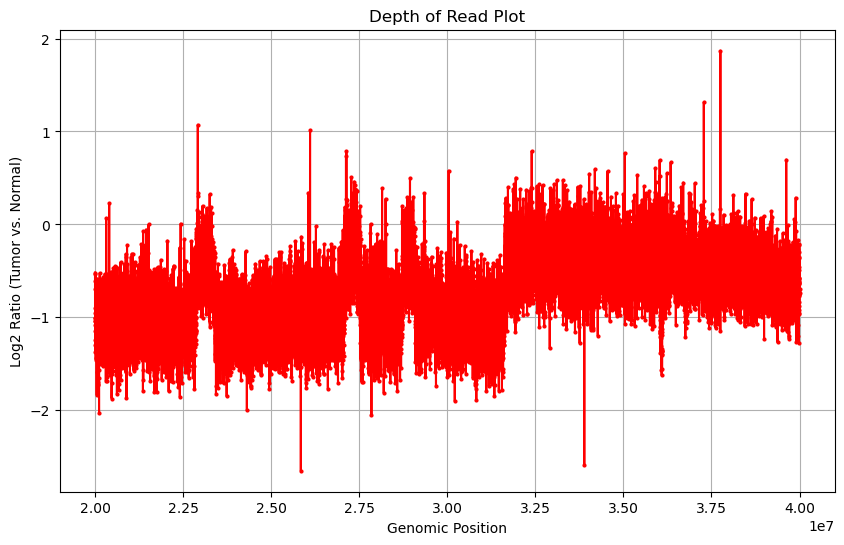

## Exercise 2

The rules `align_reads`, `sam_to_bam`, `sort_bam`, `index_bam`, `index_chrom` are
basically the same as in Exercise 1, so I'll skip them. 

To run the snakemake for both tu and wt, you have to set once tu in TYPE and wt once in TYPE.

### Subsetting BAM Files to Specific Region (rule: subset_bam)
Subsetting BAM files to a specific region on chromosome X, from 20Mbp to 40Mbp.

**Input**: Sorted BAM file.

**Output**: BAM file subset to chromosome X region.

### Sorting the Subset BAM Files (rule: sort_subset_bam)
After subsetting, it is necessary to sort the BAM file again to ensure that genomic data is organized by coordinates.

**Input**: BAM file subset to a specific region.

**Output**: Sorted subset BAM file.

### Indexing Sorted Subset BAM Files (rule: index_subset_bam)
Indexing the sorted subset BAM files.

**Input**: Sorted subset BAM file.

**Output**: Index file for the sorted subset BAM.

### Generating a read_depth File from the Subset BAM (rule: generate_read_depth)
This final step calculates the read depth across the specified region of chromosome X.

**Input**: Sorted and indexed subset BAM file.

**Output**: Text file containing read-depth information.

## Plotting the Read Depth
Loads the files using pandas (as csv). Then it computes the average depth (where the interval is set to 1000).
Finally it computes the ratio between the tumor and wildtype read depths and
computes a log2 of it. Then it is simply plotted with plotly.

You have to run the script plotter.py manually after both "wt" and "tu" are processed.

Here is the resulting plot:
