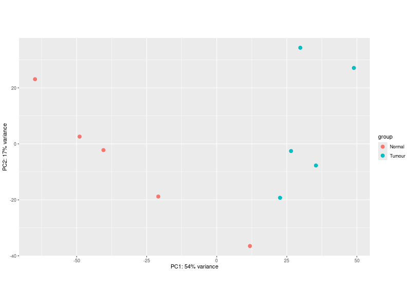
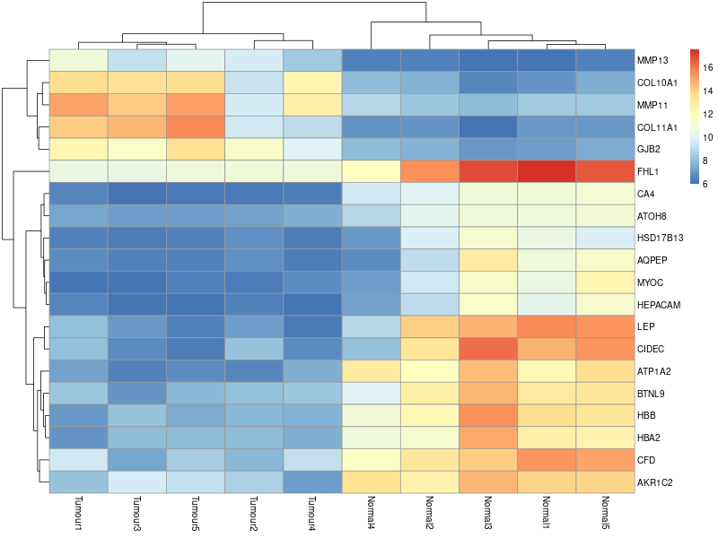

# Exercise 3

## Differential Expression Analysis

We computed the differential expression using the results() function, with the level of 0.05. The threshold for log-fold change was set to 1 (so the change is at least twice as high/low).

Then we also sortered the results by the adjusted p-value to see the most prominent different expressions.

## MA-plot

We plotted two versions of the MA-plot. The log fold usually includes a lot of noise from genes that are not supported by high count of reads. The first plot does not account for this noise, while the second plot does. We used alpha=0.05.

MA plot with noise:

MA plot without noise:

### Plotting

In the next task, we plotted the normalized counts for the GJB2 gene (a gene with the 9th lowest adjusted p-value - done in the first task by sorting the adjusted p-values). The function `plotCounts()` automatically normalizes counts by the estimated size factors, so no prior normalization is necessary. Here is the resulting plot:

### PCA Plot

We tried both transforms: Variance stabilizing transformation and Regularized log transformation. Whereas the former explained overall 71% of variance (using first two PC), the second explained just 57% (using first two PC). The class (tumor, wild) separation could be done in both cases in the same way, we yielded similar results. Therefore, we deem the former transform to result in better PCA results, visualized in the following figure:

### Heatmap visualization

Similarly we performed the heatmap visualization using both transforms. Again, only the VSD heatmap reported in this report:

### Saving the results

And, finally, we saved the significant differences into the .csv file.

